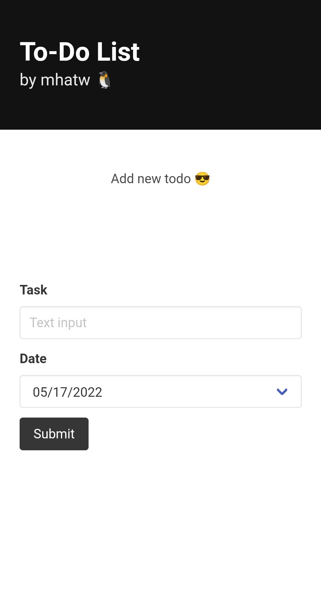

# JS TODO List

Create a ToDo list using HTML, CSS, and JS only.

The application should have a `form` to create a new task setting the message and the due date of it.

After being created it should be listed below the `form` along with a `button` to mark it as complete.
Try >>>>>>> https://reliable-frangollo-a3756d.netlify.app/

